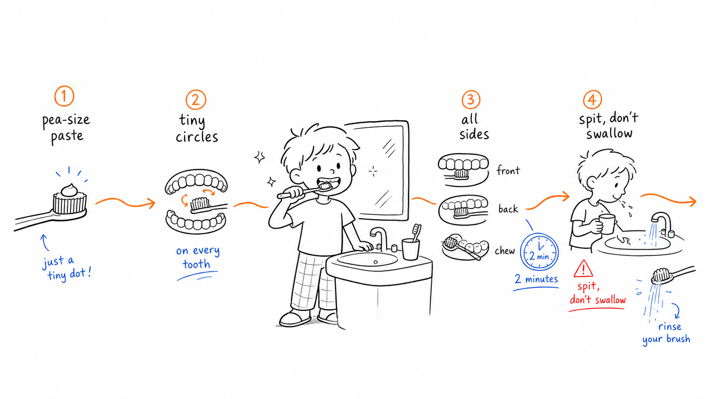

# Neat Explainers

Neat Explainers is a Codex skill for designing and generating sparse, hand-drawn English article illustrations on a pure white 16:9 canvas.

It turns one key judgment, process, structure, state, or metaphor from an article into a clean but strange explanatory image: black wobbly line art, lots of empty space, sparse red/orange/blue handwritten English annotations, and one expressive white human character doing the core conceptual action.

## Credit

Adapted from [Ian Xiaohei Illustrations](https://github.com/helloianneo/ian-xiaohei-illustrations) by Ian.

This project keeps Ian's MIT license notice and derived-project attribution. It changes the default language, character design, and prompt constraints for English article explainers.

## Install

Clone this repo and copy it into your Codex skills directory:

```bash
git clone https://github.com/anjanps55/neatexplainers.git
mkdir -p "${CODEX_HOME:-$HOME/.codex}/skills/expressive-white-article-illustrations"
rsync -a --exclude .git neatexplainers/ "${CODEX_HOME:-$HOME/.codex}/skills/expressive-white-article-illustrations/"
```

Use it in Codex:

```text
Use $expressive-white-article-illustrations to design and generate a set of sparse absurd illustrations for this English article.
```

## Prompting Best Practices

Explain the direction of the illustration clearly, but in simple terms. The best prompts say what the picture should help the reader understand, not just what objects should appear.

Strong prompts usually include:

- Topic: what the article or explanation is about
- Direction: the simple idea the image should make obvious
- Audience: who the explanation is for
- Labels: short words or phrases that should appear in the drawing
- Character: optional, only if you want to change the default character

You can change the character by describing the new character in plain language. If you leave this out, the skill uses its default expressive white human character.

Example prompt:

```text
Use $expressive-white-article-illustrations to make one 16:9 illustration explaining tooth brushing for kids.

Direction: show the steps from using a pea-size amount of toothpaste, to brushing every tooth, to brushing all sides, then spitting and rinsing.
Audience: young kids learning the routine.
Character: a smiling kid in pajamas at a bathroom sink.
Labels: "pea-size paste", "tiny circles", "all sides", "2 minutes", "spit, don't swallow", "rinse your brush".
Keep the explanation simple and visual.
```

## Examples

### Brush Teeth For Kids



## What It Produces

- 16:9 horizontal English article body illustrations
- Shot lists for articles, essays, posts, Notion docs, workflow notes, and methodology content
- Pure white backgrounds, black hand-drawn wobbly line art, and sparse red/orange/blue handwritten labels
- PNG images saved under `assets/<article-slug>-illustrations/`

## License

MIT. See [LICENSE](LICENSE) and [NOTICE.md](NOTICE.md).
